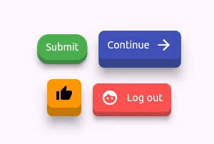
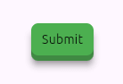
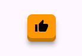
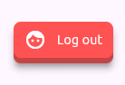
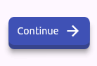

<!--
This README describes the package. If you publish this package to pub.dev,
this README's contents appear on the landing page for your package.

For information about how to write a good package README, see the guide for
[writing package pages](https://dart.dev/tools/pub/writing-package-pages).

For general information about developing packages, see the Dart guide for
[creating packages](https://dart.dev/guides/libraries/create-packages)
and the Flutter guide for
[developing packages and plugins](https://flutter.dev/to/develop-packages).
-->

# miv_buttons

**miv_buttons** is a customizable button widget for Flutter with flexible options for layout,
styling, and elevation. This widget allows you to create highly customizable buttons with various
design options such as padding, elevation, background colors, border radius, and more.



## Features

- **Customizable Design**: Easily configure the button's color, padding, and border radius.
- **Dynamic Elevation**: Supports different elevations for default and pressed states.
- **Flexible Content**: Add any widget as a child, including text, icons, or images.
- **Preconfigured button types**: For the most common buttons,
  use `Button.icon()`, `Button.label()`, `Button.iconLabel()`, `Button.labelIcon()`.

## Getting Started

### Usage

To use the `Button` widget, import the package and place it within your widget tree:

```dart
import 'package:miv_buttons/button.dart';
import 'package:flutter/material.dart';

class MyHomePage extends StatelessWidget {
  @override
  Widget build(BuildContext context) {
    return Scaffold(
      appBar: AppBar(
        title: Text('Custom Button Example'),
      ),
      body: Center(
        child: Button(
          onClick: () {
            print('Button pressed');
          },
          child: Text('Click Me'),
          color: Colors.blue,
          borderRadius: 8.0,
          horizontalPadding: 16.0,
          verticalPadding: 12.0,
          elevation: 6.0,
          pressedElevation: 2.0,
        ),
      ),
    );
  }
}
```

### Named Constructors

The `miv_buttons` package provides additional named constructors to create buttons with specific
layouts more easily. These constructors help in quickly setting up common button types like icon
buttons or buttons with labels.
At the moment there are 4 options:  `Button.label()`, `Button.icon()`,`Button.iconLabel()`
and `Button.labelIcon()`

## `Button.label()`

This constructor creates a button with a text label. It is useful when you need a simple text-based
button.



```dart
Button.label(
  onClick: () {
    print('Label button pressed');
  },
  label: 'Submit',
  color: Colors.green,
  labelColor: Colors.black,
)
```

## `Button.icon()`

This constructor is designed to create a button that features an icon. It is perfect for use cases
where a simple visual button is required without text labels.



```dart
Button.icon(
  onClick: () {
    print('Icon button pressed');
  },
  icon: Icons.thumb_up,
  color: Colors.orange,
  iconColor: Colors.black,
)
```

## `Button.iconLabel()`

This constructor is designed to create a button that includes both an icon and a text label. The
icon is on the left of the label if `isHorizontal` is `true` (default). When you set `isHorizontal`
to `false`, the icon will appear over the label.



```dart
Button.iconLabel(
  onClick: () {
    print('Button pressed');
  },
  icon: Icons.face,
  label: 'Log out',
  color: Colors.redAccent,
  foregroundColor: Colors.white,
  gap: 12.0,
)
```

## `Button.labelIcon()`

Similarly to the previous one, this constructor is designed to create a button that includes both an icon and a text label. This time the
label is on the left of the icon if `isHorizontal` is `true` (default). When you set `isHorizontal`
to `false`, the label will appear over the icon.



```dart
Button.labelIcon(
  onClick: () {
    print('Button pressed');
  },
  icon: Icons.arrow_forward,
  label: 'Continue',
  color: Colors.indigo,
  foregroundColor: Colors.white,
)
```

### Customization Options

The `Button` widget in **miv_buttons** comes with several properties that you can tweak to fit your
UI needs. Here are the properties you can set for the `Button` and all the named constructors:

| Property            | Type            | Default            | Description                                                                                        |
|---------------------|-----------------|--------------------|----------------------------------------------------------------------------------------------------|
| `onClick`           | `VoidCallback?` | -                  | The callback triggered when the button is pressed. If `null`, the button is disabled. **Required** |
| `color`             | `Color?`        | `0xFF2196F3`(blue) | The background color of the button.                                                                |
| `borderRadius`      | `double?`       | `8.0`              | The border radius for rounding the corners of the button.                                          |
| `horizontalPadding` | `double?`       | `12.0`             | Defines the horizontal padding between the button's content and its edges.                         |
| `verticalPadding`   | `double?`       | `8.0`              | Defines the vertical padding between the button's content and its edges.                           |
| `elevation`         | `double?`       | `6.0`              | The elevation of the button when in its default state.                                             |
| `pressedElevation`  | `double?`       | `2.0`              | The elevation of the button when pressed.                                                          |

Additional properties specific to `Button()` constructor:

| Property            | Type            | Default            | Description                                                                |
|---------------------|-----------------|--------------------|----------------------------------------------------------------------------|
| `child`             | `Widget`        | -                  | The content of the button, typically text, icons, or any widget. Required. |


Additional properties specific for `Button.label()` constructor:

| Property     | Type         | Default             | Description                                                            |
|--------------|--------------|---------------------|------------------------------------------------------------------------|
| `label`      | `String`     | -                   | The text label displayed on the button. **Required**.                  |
| `labelColor` | `Color?`     | `0xFFFFFFFF`(white) | The color applied to the label. You can override it in `labelStyle`.   |
| `labelStyle` | `TextStyle?` | -                   | The text style applied to the label.                                   |


Additional properties specific for `Button.icon()` constructor:

| Property     | Type         | Default             | Description                                     |
|--------------|--------------|---------------------|-------------------------------------------------|
| `icon`       | `IconData`   | -                   | The icon displayed on the button. **Required**. |
| `iconColor`  | `Color?`     | `0xFFFFFFFF`(white) | The color applied to the icon.                  |


Additional properties specific for `Button.iconLabel()` and `Button.labelIcon()` constructors:

| Property          | Type         | Default             | Description                                                                                                                                                                 |
|-------------------|--------------|---------------------|-----------------------------------------------------------------------------------------------------------------------------------------------------------------------------|
| `icon`            | `IconData`   | -                   | The icon displayed on the button. **Required**.                                                                                                                             |
| `label`           | `String`     | -                   | The text label displayed on the button. **Required**.                                                                                                                       |
| `foregroundColor` | `Color?`     | `0xFFFFFFFF`(white) | The color applied to the icon and the label. You can override label color in `lableStyle`                                                                                   |
| `labelStyle`      | `TextStyle?` | -                   | The text style applied to the label.                                                                                                                                        |
| `isHorizontal`    | `bool?`      | `true`              | Determines the layout direction of the icon and the label. If `true` (default), the icon and the label are arranged horizontally; if `false`, they are arranged vertically. |
| `gap`             | `double?`    | `8.0`               | The space between the icon and the label.                                                                                                                                   |


### Example

Here's a more detailed example of how to use **miv_buttons** to create a custom button:

```dart
import 'package:flutter/material.dart';
import 'package:miv_buttons/button.dart';

void main() => runApp(MyApp());

class MyApp extends StatelessWidget {
  @override
  Widget build(BuildContext context) {
    return MaterialApp(
      home: Scaffold(
        appBar: AppBar(
          title: Text('miv_buttons Example'),
        ),
        body: Center(
          child: Button(
            onClick: () {
              print('Custom button pressed');
            },
            child: Row(
              mainAxisSize: MainAxisSize.min,
              children: [
                Icon(Icons.thumb_up, color: Colors.white),
                SizedBox(width: 8),
                Text('Like', style: TextStyle(color: Colors.white)),
              ],
            ),
            color: Colors.blue,
            borderRadius: 12.0,
            horizontalPadding: 20.0,
            verticalPadding: 14.0,
            elevation: 12.0,
            pressedElevation: 4.0,
          ),
        ),
      ),
    );
  }
}
```

### Contributing

Contributions are welcome! If you have ideas or improvements, feel free to submit a pull request or
open an issue.
